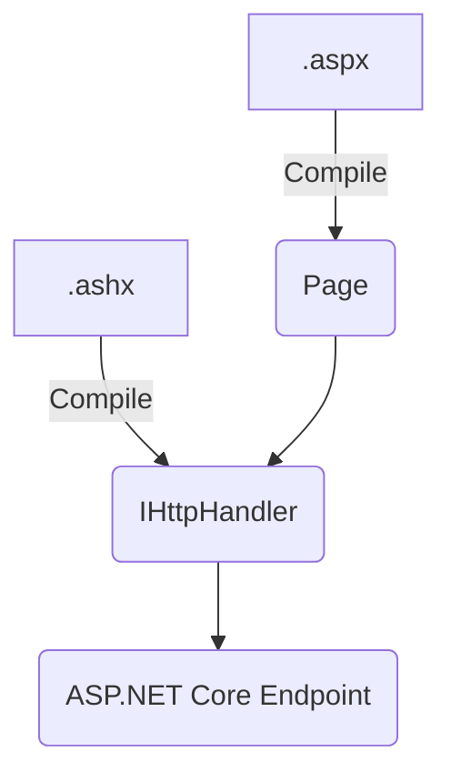
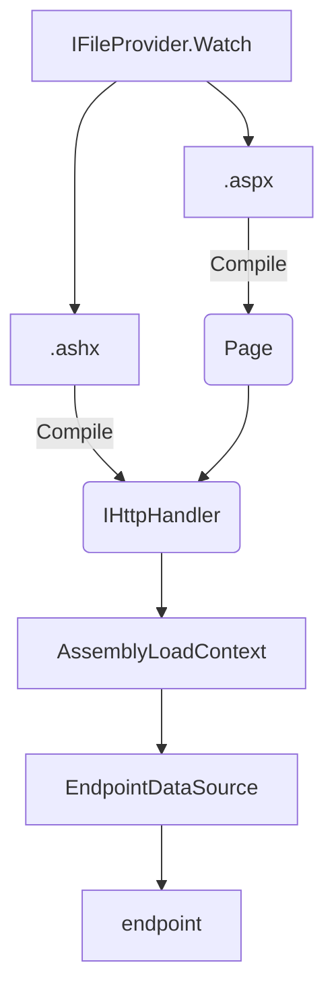

# WebForms on ASP.NET Core

The goal of this project is to explore building some of the basic building blocks of the WebForms on ASP.NET Core. This will isolate out the actual components needed to build a functional page.

In scope:

- `System.Web.IHttpHandler`
- `System.Web.UI.Page`
- `System.Web.UI.HtmlTextWriter`
- `System.Web.UI.HtmlControls.*`
- `System.Web.UI.WebControls.*`

Stretch goals:

- Compilation of `.aspx` and `.ashx`
- Runtime compilation of `.aspx` and `.ashx` pages
- Master pages

What is *NOT* in scope for this project:

- Designer support
- `System.Web` hosting model
- `System.Web` membership model
- Any `System.Web` concept not called out as in scope

This will make use of `Microsoft.AspNetCore.SystemWebAdapters` to provide the `System.Web.HttpContext` that is at the core of the WebForms pipeline.

# Architecture

There are a few components that are needed to make `.ashx`/`.aspx` to work.

In the case of static compilation (i.e. the `Compile` process below is done at build time):



However, in the dynamic compilation mode (i.e. an `.aspx` page is found in the directory at run time and the code is generated on the fly), it would look more like this:



## IHttpHandler/IHttpModule infrastructure

This project has some initial support for `IHttpHandler`. However, this ideally would move into the main [dotnet/systemweb-adapters](https://github.com/dotnet/systemweb-adapters) repo (see [here](https://github.com/dotnet/systemweb-adapters/tree/tasou/http-application) for what that might look like). All that's needed here is `IHttpHandler` support, although there may be a need for some aspects of `IHttpModule` that would be out of scope for this project.

## HtmlTextWriter

`HtmlTextWriter` is how custom controls would write to the response. The majority of that infrastructure was copied from [referencesource](https://referencesource.microsoft.com/#System.Web/UI/HTMLTextWriter.cs,671c476a45af082b) and is (for the most part) as-is from .NET Framework.

## Controls

The majority of pages rely on built-in controls that derive from `System.Web.UI.Controls`. This includes the collection of controls for server side HTML controls (deriving from `System.Web.UI.HtmlControl`).

A common pattern that differs in this implementation of controls is that in `System.Web` it was common to search up the hierarchy for a control that was in chard of some service (i.e. `NamingContainer` would be the one that tracks what the next id should be). In this implementation, we are making use of `IFeatureCollection`, where each level can have it's own, but the hieararchy can be searched. For performance reasons, the feature colleciton is only instantiated if it needs to add something to it (most controls will probably not need to add anything to it). For an example of this in the current implementation, see [the naming feature](./src/WebForms/UI/Features/UniqueIdGeneratorFeature.cs).

## Pages

Pages are the main container of a collection of user controls. This is an implementation of `System.Web.UI.Page` or the contents of an `.aspx` page. This implements `IHttpHandler` (more specifically for our implementation, we'll use `IAsyncHttpHandler` which was not used for some reason ASP.NET Framework).

To map a page to be served, you can use the following extension methods:

```csharp

var builder = WebApplication.CreateBuilder(args);

builder.Services.AddSystemWebAdapters()
    .AddDynamicPages();

var app = builder.Build();

app.UseSystemWebAdapters();

app.MapAspxPages();
app.MapAspxPage<MyPage>("/some/path.aspx");
app.MapDynamicAspxPages(app.Environment.ContentRootFileProvider);
```

## Compilation

Compilation in `System.Web` made use of `MSBuild` and `CodeDom` technologies and was tightly coupled to the `Page`, `Control` and other types. Going forward, this implementation will build the compilation infrastructure as a layer above the types in `System.Web.UI` namespace.

There are a few ways to handle compilation:

- **[Source Generators](./gen/UI.Generator)**: This would allow for static compilation and happen as part of the build process. This would include the pages and handlers as part of the assembly they're in instead of as additional assemblies like the other options. *NOTE: Not support for Visual Basic*
- **aspnet_compiler**: This was the entry point for compilation that customers would use to manually compile their pages into controls. This would use Roslyn behind the scenes to generate an assembly.
- **[Runtime Compilation](./src/RuntimeCompilation)**: This was the default for many people and allowed them to put an `.aspx` page in the deployed directory and have it be served up. This would utilize the same logic as `aspnet_compiler`, but also load up the assemblies in a custom unloadable AssemblyLoadContext and a custom `EndpointDataSource` that allows for updates

These can all be supported by using a single [library](./gen/AspxParser/) to parse and generated the source files. Initially with C#, but Visual Basic support is a high priority.
