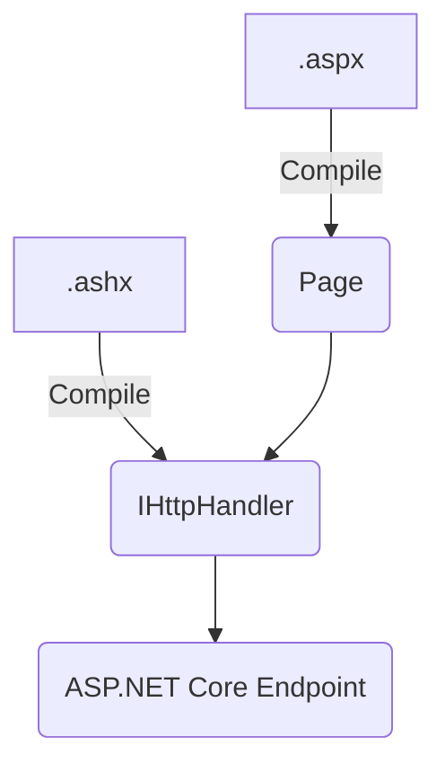

# Running IHttpHandler on ASP.NET Core

`IHttpHandler` was the basic unit of what would be executed given a path. The closest analog to this is the `Endpoint` type in ASP.NET Core. Since WebForms pages are built on top of `IHttpHandler`, it makes sense to hook up the pages via this type.



To that end, we will expose a few building blocks that allow handlers to work. The requirements of this are:

1. We must be able to add a handler for a given a path (previously, this was done in `web.config`)
1. We must be able to dynamically add or remove handlers
1. We must be able to name a handler and map it to another path (previously, this was done via the APIs in the `System.Web.Routing` namespace)

In order to enable this, we have introduced an interface that allows for identifying handlers and can notify the system of any changes:

```csharp
namespace Microsoft.AspNetCore.SystemWebAdapters.HttpHandlers;

/// <summary>
/// A collection to manage the known <see cref="System.Web.IHttpHandler"/> paths.
/// </summary>
public interface IHttpHandlerCollection
{
    /// <summary>
    /// Gets the known <see cref="IHttpHandlerMetadata"/> instances to generate endpoints.
    /// </summary>
    /// <returns></returns>
    IEnumerable<IHttpHandlerMetadata> GetHandlerMetadata();

    /// <summary>
    /// Gets the named routes from the collection that can be used to map routes to known paths.
    /// </summary>
    IEnumerable<NamedHttpHandlerRoute> NamedRoutes { get; }

    /// <summary>
    /// A change token for when the collection changes.
    /// </summary>
    /// <returns></returns>
    IChangeToken GetChangeToken();
}
```

In order to register these for ASP.NET Core, they must each be added to the `IServiceCollection`. Then, in order to add endpoints, one must call the map function:

```csharp
var builder = WebApplication.CreateBuilder(args);

// Register handler infrastructure
builder.Services.AddSystemWebAdapters()
    .AddHttpHandlers();

// Add custom implementation
builder.Services.AddSingleton<IHttpHandlerCollection>(new MyCustomCollection());

var app = builder.Build();

app.MapHttpHandlers();
```

The `MapHttpHandlers` method will now query all the registered `IHttpHandlerCollection` instances to identify available handlers and ensure they will be surfaced as endpoints in the pipeline.
